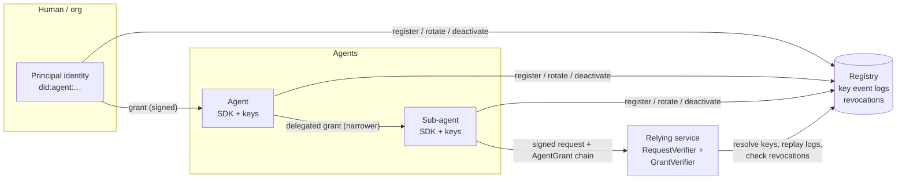
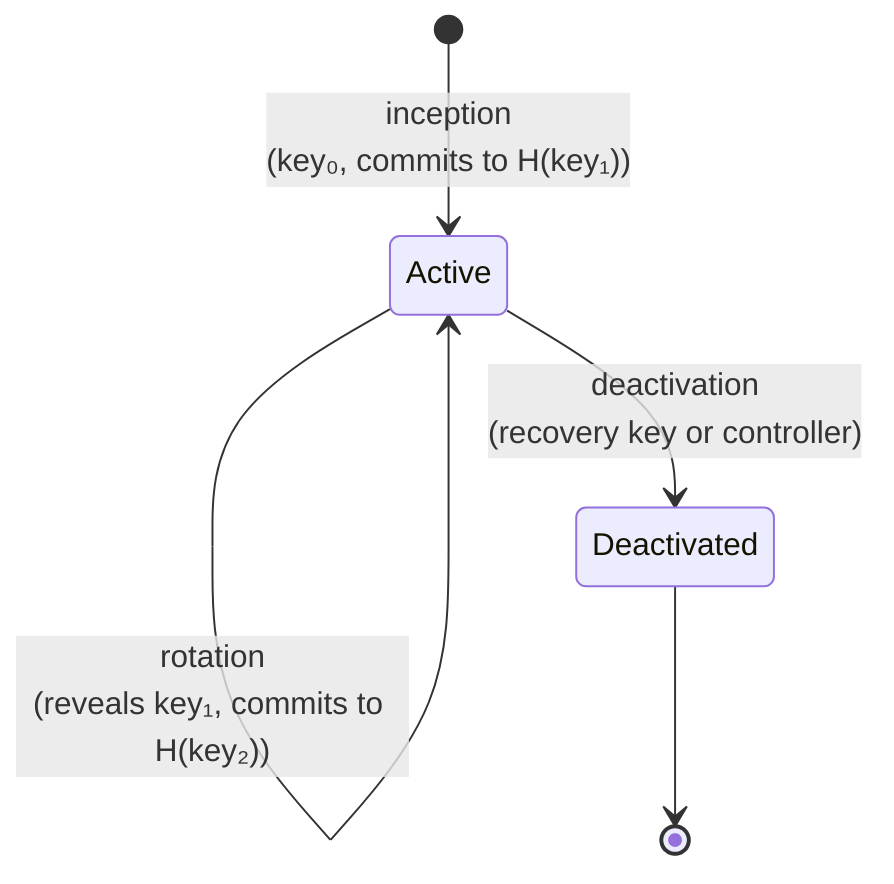
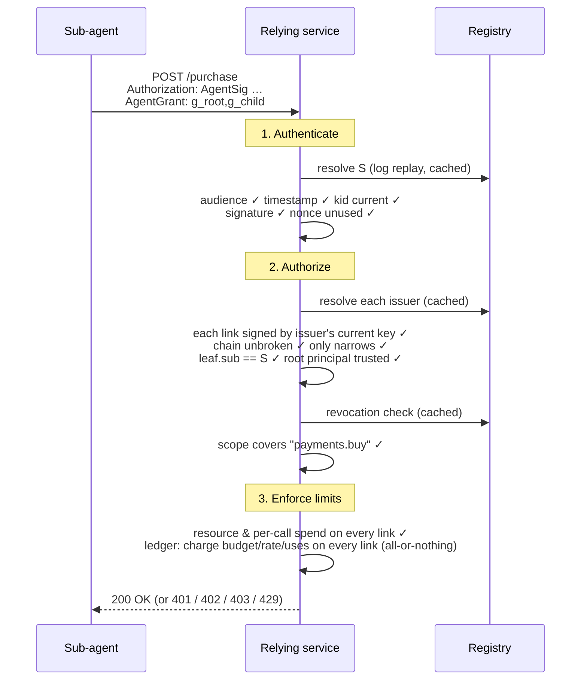
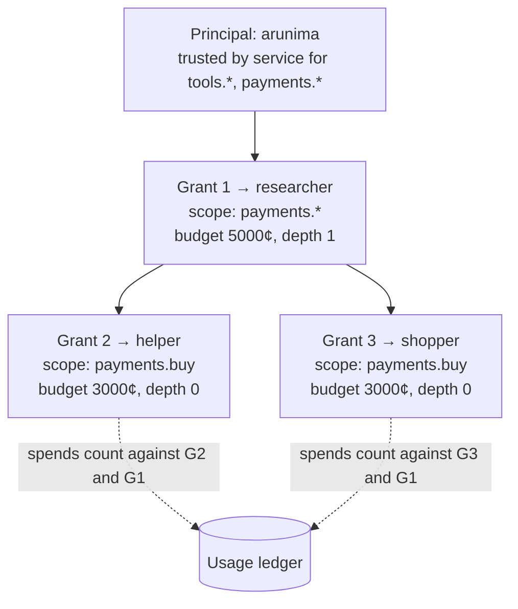

# Architecture

## Components

| Component | Code | Role |
|---|---|---|
| **Crypto primitives** | `agentauth/crypto.py` | Ed25519 keys, base58btc/multibase, multikeys, canonical JSON, SHA-256 multihash digests |
| **Identity** | `agentauth/identity.py` | Builds and verifies key event log (KEL) events; derives DIDs; produces DID documents. Pure functions with no I/O. |
| **Request signing** | `agentauth/httpsig.py` | `AgentSig` header: signing and verification, replay (nonce) cache |
| **Grants** | `agentauth/grants.py` | Capability grants, delegation chains, scope algebra, revocation events, `GrantVerifier` |
| **Limits** | `agentauth/limits.py` | Resource/spend/rate/use limits, attenuation rules, `UsageLedger` |
| **Keystore** | `agentauth/keystore.py` | Encrypted key files; current and recovery keys stored separately |
| **SDK** | `agentauth/sdk.py` | `AgentIdentity`, `RegistryClient`, httpx/httpx2 auth hook, caching resolvers for services |
| **Integrations** | `agentauth/integrations.py` | FastAPI dependencies: `fastapi_dependency` (identity) and `fastapi_authorizer` (scopes + limits) |
| **Registry** | `agentauth/server.py`, `agentauth/store.py` | HTTP service storing KELs and revocations (SQLite) |
| **CLI** | `agentauth/cli.py` | `agentauth` command wrapping the SDK and registry |

## The registry is a witness, not an authority

The registry stores each identity's key event log and serves it back. It **validates** every event before accepting it, but it **cannot forge** one:

- A DID is the digest of its own signed inception event, so the registry can't create or change one.
- Every later event is signed and hash-chained to the one before it.
- `RegistryKeyResolver` (used by services) downloads the **full log** and replays it locally by default, instead of trusting the registry's summary.

What the registry *can* do is withhold events or show different clients different logs. See [threat model: registry equivocation](threat-model.md#registry-equivocation).

## Lifecycle of an identity

1. **Inception.** The agent generates two keypairs: a *current* key and a *next* (recovery) key. It signs an inception event containing the current public key and a hash of the next one. If it has a controller, the controller countersigns. The DID is the digest of this event.
2. **Rotation.** To rotate, the agent reveals the pre-committed next key, signs the rotation with it, and commits to a new next key. Holding only the current key isn't enough.
3. **Deactivation.** Either the holder of the recovery key or the controller (with its current key) can permanently deactivate the identity. Nothing can be appended afterwards.

## What happens on a request

**Status codes:**

| Code | Meaning |
|---|---|
| **401** | Authentication failed: bad signature, stale timestamp, replayed nonce, wrong audience, unknown or deactivated agent, rotated key, or no grant presented |
| **403** | Authorization failed: grant invalid, untrusted principal, revoked, scope not covered, resource not covered, per-call spend exceeded, or uses exhausted |
| **402** | Budget exhausted |
| **429** | Rate limit reached (the message says when to retry) |
| **400** | Malformed input, or a requested resource containing `..` |

## How authority flows

Every call is charged against **every** grant in its chain. Grants 2 and 3 each allow 30 USD, but together they can't exceed Grant 1's 50 USD. Revoking Grant 1 (or deactivating `researcher`) cuts off both sub-agents at once.

## Caching and freshness

Services cache lookups so they don't hit the registry on every request. The cache TTLs set how quickly a change takes effect:

| Cache | Default | What a stale entry means |
|---|---|---|
| `RegistryKeyResolver` (keys and active status) | 30 s | A deactivated agent keeps working for up to 30 s. A **rotation** is picked up immediately, because a newer `kid` forces a refresh. |
| `RegistryRevocationChecker` ("not revoked" answers) | 10 s (5 s in the example service) | A revoked grant keeps working for up to that long. "Revoked" answers are cached permanently. |
| Nonce cache | 2 × max clock skew (240 s) | In-memory and per process (see [operations](operations.md)). |

Set any TTL to `0` for immediate effect, at the cost of a registry round-trip per request.
